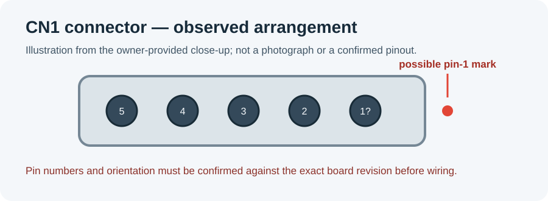

# Rheem EcoNet Tankless for Home Assistant

HACS custom integration for local Rheem EcoNet tankless water heaters over a USB-to-RS-485 adapter. The initial device profile targets the Rheem Prestige RTGH-RH11DVLN (product 689371) and follows the tankless datapoints used by [ESPHome EcoNet](https://github.com/esphome-econet/esphome-econet).

## Current status

This is an early integration and has not yet been validated against a physical heater. Protocol defaults follow the [ESPHome tankless profile](https://github.com/esphome-econet/esphome-econet/blob/main/econet_tankless_water_heater.yaml): 38,400 baud, source address `0x340`, appliance address `0x1040`, and a 5-second polling interval. ESPHome lists modern Rheem tankless heaters as supported, but that does not prove this independent Python implementation works with this exact unit.

The initial hardware target supplied for development is **RTGH-RH11DVLN**, product **689371**, controller revision **00.06**. The integration is designed to provide a climate control for water-heater enable/setpoint and sensors for inlet/outlet temperature, flow, water usage, gas usage, and ignition cycles. These datapoints are inherited from the ESPHome tankless profile; support for this exact product and revision has not been confirmed on a live heater. Verify reads and control writes before relying on automations.

## Physical connector evidence

The owner-provided control-board close-up shows a five-position connector identified as **CN1 / RS-485** on the cabinet wiring diagram. A small dot/mark appears at one end and may identify pin 1; use the board silkscreen and connector orientation to verify that, since a connector viewed from its wire side can be mirrored. The uploaded images are not stored in this repository yet. The following drawing records the observed five-position arrangement; it is an orientation aid, not a photograph or a verified pinout.

There is a documentation mismatch that must be resolved before wiring:

- The [Rheem RTGH-RH11DV manual](https://files.myrheem.com/webpartners/ProductDocuments/7496DB1F-380B-46AC-951E-BA17CA39DF8A.pdf) identifies controller **NGTH-9700C** and lists **CN1, part SMW250-03**, as a three-position connector: pin 1 = RS-485+, pin 2 = GND, pin 3 = RS-485−.
- A separate [Infiniti GR installation-manual copy](https://device.report/m/234349ef29b723e3262b36cd8182a85953f5f1648555bd19c3df8a3ce24be25a_optim.pdf) describes a five-position CN1 with RS-485 signals on pins 1/2 and 4/5 and pin 3 unused. That is a different documented connector variant; it has **not** been matched to this heater's board revision.
- The [ESPHome-EcoNet hardware guide](https://github.com/esphome-econet/esphome-econet/wiki/Recommended-Hardware-Purchase-and-Setup-Instructions) documents a separate RJ11/RJ12 connection: jack pin 3 = B−, pin 4 = A+, and pin 5 = GND. Those jack pin numbers are not CN1 header pin numbers.
- An unverified pinout proposal describes this observed five-position header as pin 1 = +12 V, pin 2 = GND, pin 3 = RS-485 A, pin 4 = RS-485 B, pin 5 = shield/NC. No Rheem source located so far supports these assignments for controller revision **RHe_V0106**. Do not apply its suggested red/black/white/green wiring.

The RTGH-RH11DV manual is the best primary source found so far, but it does not establish that the five-position connector shown in the owner-provided photo is the same three-position CN1 it documents, or that its pinout applies to revision **RHe_V0106**. The pin-1 marker alone cannot identify the other signals. **Do not connect the USB-RS485 adapter or any supply to the observed five-position header until Rheem confirms the connector and pin functions for this exact board revision.** In particular, do not inject 5 V or 12 V into an unverified pin. The proposed continuity/voltage-probing procedure is also inconclusive: chassis or RJ-jack shield continuity does not by itself prove signal ground, and averaged RS-485 line voltages do not reliably identify A/B.

### Question for Rheem

For the **RTGH-RH11DVLN**, product **689371**, with control board marked **NGTH-9700C / RHe_V0106**, please confirm:

1. Whether the five-position connector visible in the attached/owner-observed board photo is **CN1** and is intended for RS-485.
2. The pin numbering/orientation and electrical function of every position, including whether any pin supplies power and its voltage/current rating.
3. The correct mating connector series/part number and whether this board revision differs from the three-position **CN1 / SMW250-03** shown in the RTGH-RH11DV manual.
4. Whether the RJ11/RJ12 jack is an approved alternative RS-485 connection for this exact model/revision, including its pinout and signal-ground requirements.

The original board photos should accompany this question; they are not included in this repository because they were not available as files in the workspace when this note was prepared.

## Install and try through HACS

1. In HACS, open **⋮ → Custom repositories**, enter `https://github.com/5310H/rheem-econet-addon`, and choose **Integration**. Install **Rheem EcoNet Tankless** and restart Home Assistant. This repository is a HACS custom integration, not a Home Assistant add-on.
2. In **Settings → Devices & services → Add integration**, select **Rheem EcoNet Tankless**. The serial path is a text field so setup can be tried before the adapter or heater is attached. For a no-hardware UI/install check, enter `/dev/serial/by-id/not-connected` and keep the default addresses. Setup will complete and its entities will show unavailable until a responding heater is connected. Remove that test entry or edit its options when the real serial path is available.
3. For hardware use, connect a compatible, isolated USB-to-RS-485 adapter to the heater's documented low-voltage RS-485 terminals, then connect USB directly to the machine running **Home Assistant OS**. This setup uses HACS inside Home Assistant Core; it is not a Supervisor add-on and has no add-on container or VM boundary. HAOS itself must detect the adapter and expose it to Home Assistant Core, preferably at a stable `/dev/serial/by-id/...` path. No separate VM USB passthrough is involved. If HAOS does not expose the adapter, HACS cannot make the serial device appear; troubleshoot host USB detection/serial device mapping first.
4. Configure the actual `/dev/serial/by-id/...` path in the integration options. Start with read-only observations; only try setpoint and enable controls while monitoring the heater.

Rheem's [RTGH series document page](https://www.rheem.com/product/rheem-rtgh-series-super-high-efficiency-condensing-indoor-tankless-gas-water-heater-rtgh-68dvlp-3/related-documents/160030/) links the Use & Care and service documents. The earlier RTGH-RH11DV Use & Care manual identifies RS485+ and RS485− as low-voltage (SELV 5 V) terminals, but it does not specify the software packet protocol or approve this HA integration. Do not connect an adapter to mains-voltage terminals. Follow the manual and use a properly isolated RS-485 interface. Do not assume another EcoNet module setup is safe for this exact unit without verification.

The packet-level information used here is community-derived: see the [ESPHome tankless configuration](https://github.com/esphome-econet/esphome-econet/blob/main/econet_tankless_water_heater.yaml), its [object reference](https://github.com/esphome-econet/esphome-econet/wiki/Objects), and the community [protocol-documentation collection](https://github.com/esphome-econet/econet-docs/tree/main/protocol-documentation). The Rheem BACnet specification in that collection is an object list for a BACnet interface; it is not proof that this proprietary serial transport uses BACnet framing.

## Controls and limits

The water-heater climate entity is intended to expose Off/Heat and a target range of 110–140 °F, matching the tankless ESPHome profile. The integration writes the `WHTRENAB` and `WHTRSETP` datapoints. The setpoint is a water-heater setting; it does not operate the gas valve directly. The public profile uses `WHTRENAB` values 0=OFF and 1=HEAT. Upstream ESPHome sends writes without waiting for a protocol ACK, so this integration treats a write as a command attempt and relies on a later poll to observe whether the requested state took effect. That behavior is not yet verified against this heater.

The integration also adds a **Rheem Water Heater** page to the Home Assistant sidebar. It shows connection state, outlet and target temperatures, and the integration's sensor readings, with temperature and Off/Heat controls when the heater is responding. These controls call the same Home Assistant climate services as the device page.

### Recirculation pump

This integration does not control the recirculation pump. The ESPHome tankless profile does not expose a pump control. In an [upstream discussion](https://github.com/esphome-econet/esphome-econet/discussions/558), attempts to write `RCIRPUMP` and `RPUMPMOD` changed displayed state but did not start the pump; a maintainer also reported the values could remain stuck. Do not use those datapoints as pump commands.

Rheem's [RTGH use and care manual](https://files.rheem.com/blobazrheem/wp-content/uploads/sites/2/RTGH-Use-and-Care-Manual.pdf) documents an optional push-button input, connector CN3 (`SMW250-06`), pins 1 and 2, identified as SELV 5 V. Rheem lists its wired push-button accessory for on-demand recirculation on RTGH-RH models in its [tankless product guide](https://files.myrheem.com/webpartners/ProductDocuments/61FC6DCA-20B4-443F-A46B-3B86D6FAF1BD.pdf). This points to a physical button input as the viable on-demand path, rather than an established RS-485 command. The exact board connector and behavior still need confirmation on RTGH-RH11DVLN controller revision 00.06. Do not connect a guessed GPIO or relay directly; use an isolated, normally-open momentary contact interface only after confirming the exact pins and electrical behavior.

Because the current integration communicates only over USB-to-RS-485, it cannot operate that separate push-button input by itself. Adding pump control would require a separately HA-controlled relay/interface or a verified EcoNet command, followed by testing on the installed heater.

## What needs the installed heater

- Obtain Rheem's written confirmation of the five-position connector and pinout for board revision RHe_V0106 before connecting any adapter or power source.
- Verify serial framing, read ACK parsing, datapoint types, CRC, and write/read-back behavior against controller revision 00.06.
- Identify the optional push-button connector on the actual control board and verify a safe isolated contact-closure method for on-demand recirculation.
- Verify that Home Assistant OS exposes the chosen USB adapter as a stable serial device.
- Test reads, setpoint changes, and enable/disable behavior while monitoring the heater.
- Confirm any stock EcoNet module interaction on this exact appliance before depending on writes. Upstream has a report that writes are safe alongside the stock module on a different model, but this is not unit-specific validation.

Until then, consider this experimental software. Do not use write-based automations as a safety control or as a replacement for the heater's own controls.

## Development

The serial transport and datapoint mapping are isolated under `custom_components/rheem_econet/`. Contributions and reports should include heater model, product number, controller revision, and sanitized protocol diagnostics. Do not post serial numbers, Wi-Fi credentials, or unredacted account details.

The Home Assistant Python package in `.venv-ha` is for local development checks only. It does not install files on the HAOS machine; install this repository on HAOS through HACS.

## License

This project is licensed under the MIT License. See [LICENSE](LICENSE).
